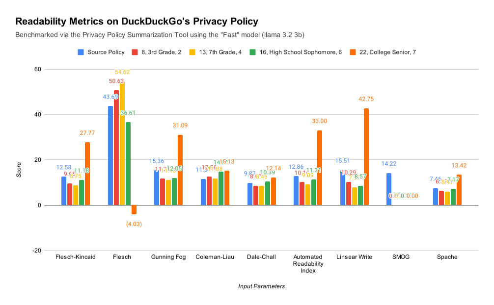
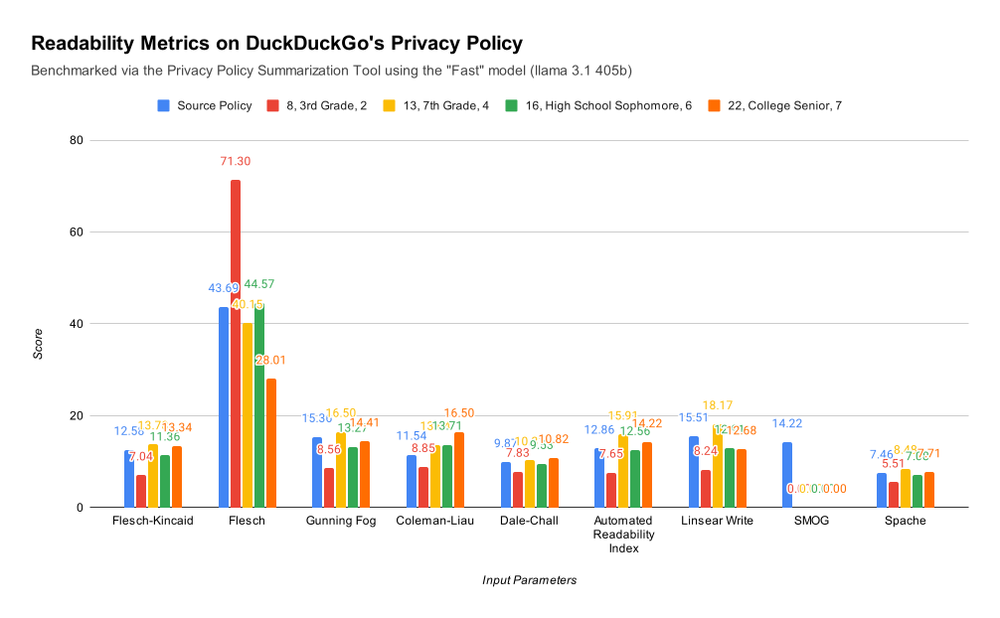

# readability-calc
Calculate various readability scores for a piece of text using py-readability-metrics

## Installation

This project uses `poetry` for dependency management. To install the dependencies, run the following command:

```bash
poetry install
```

## Usage

```bash
% poetry run python readability_calc/__init__.py -h
usage: __init__.py [-h] input output

Calculate various readability scores for a piece of text using py-readability-metrics

positional arguments:
  input       Source text input for readability analysis
  output      Output CSV file for readability results

options:
  -h, --help  show this help message and exit
```

## Results




## Scoring

### Flesch-Kincaid Grade Level

Via Wikipedia:


The result is a number that corresponds with a U.S. grade level.

### Flesch Reading Ease

The formula is as follows:


| **Score** | **School level (US)** | **Notes** |
|-----------|-----------------------|-----------|
| 100.00–90.00 | 5th grade | Very easy to read. Easily understood by an average 11-year-old student. |
| 90.0–80.0 | 6th grade | Easy to read. Conversational English for consumers. |
| 80.0–70.0 | 7th grade | Fairly easy to read. |
| 70.0–60.0 | 8th & 9th grade | Plain English. Easily understood by 13- to 15-year-old students. |
| 60.0–50.0 | 10th to 12th grade | Fairly difficult to read. |
| 50.0–30.0 | College | Difficult to read. |
| 30.0–10.0 | College graduate | Very difficult to read. Best understood by university graduates. |
| 10.0–0.0 | Professional | Extremely difficult to read. Best understood by university graduates. |

### Gunning Fog Index

| **Fog Index** | **Reading level by grade** |
|-----------|---------------------|
| 17 | College graduate |
| 16 | College senior |
| 15 | College junior |
| 14 | College sophomore |
| 13 | College freshman |
| 12 | High school senior |
| 11 | High school junior |
| 10 | High school sophomore |
| 9 | High school freshman |
| 8 | Eighth grade |
| 7 | Seventh grade |
| 6 | Sixth grade |

The formula is as follows:


### Coleman-Liau Index

The formula is as follows:


The result is a number that corresponds with a U.S. grade level.

### Dale–Chall Readability Formula

| **Score** | **Notes** |
|---------|--------|
| 4.9 or lower | easily understood by an average 4th-grade student or lower |
| 5.0–5.9 | easily understood by an average 5th- or 6th-grade student |
| 6.0–6.9 | easily understood by an average 7th- or 8th-grade student |
| 7.0–7.9 | easily understood by an average 9th- or 10th-grade student |
| 8.0–8.9 | easily understood by an average 11th- or 12th-grade student |
| 9.0–9.9 | easily understood by an average college student |

The formula is as follows:


### Automated Readability Index

| Score | Age | Grade Level |
|--------|-----|-------------|
| 1 | 5-6 | Kindergarten |
| 2 | 6-7 | First Grade |
| 3 | 7-8 | Second Grade |
| 4 | 8-9 | Third Grade |
| 5 | 9-10 | Fourth Grade |
| 6 | 10-11 | Fifth Grade |
| 7 | 11-12 | Sixth Grade |
| 8 | 12-13 | Seventh Grade |
| 9 | 13-14 | Eighth Grade |
| 10 | 14-15 | Ninth Grade |
| 11 | 15-16 | Tenth Grade |
| 12 | 16-17 | Eleventh Grade |
| 13 | 17-18 | Twelfth Grade |
| 14 | 18-22 | College student |

The formula is as follows:


### Linsear Write Formula

The standard Linsear Write metric Lw runs on a 100-word sample.
- For each "easy word", defined as words with 2 syllables or less, add 1 point.
- For each "hard word", defined as words with 3 syllables or more, add 3 points.
- Divide the points by the number of sentences in the 100-word sample.
- Adjust the provisional result r:
    - If r > 20, Lw = r / 2.
    - If r ≤ 20, Lw = r / 2 - 1.

The result is a "grade level" measure, reflecting the estimated years of education needed to read the text fluently.

### SMOG Index

SMOG is an acronym for "Simple Measure of Gobbledygook".

The formula is as follows:


The result is a number that corresponds with a U.S. grade level.

### Spache Readability Formula

The Spache readability formula is a readability test for writing in English, designed by George Spache. It works best on texts that are for children up to fourth grade. For older children, the Dale–Chall readability formula is more appropriate.

The revised formula is as follows:


The result is a number that corresponds with a U.S. grade level.
